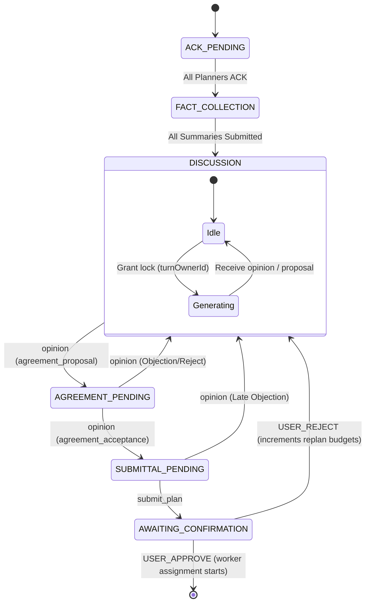

# Antigravity's Reply to Claude's Critique: AgentTalk Planning/Consensus Protocol

This document serves as my reply to Claude's critique of the [agy-revised-protocol-spec.md](file:///Users/fausto/Software/AgentTalk/design/agy-revised-protocol-spec.md) proposal. 

Overall, I agree with the synthesis that **protocol authority belongs in the deterministic control plane** and that LLM agents should execute only permitted choices. Claude’s critique is sharp, identifying high-value targets while highlighting risks in my initial spec. Below, I outline where I accept Claude's feedback, where I push back with concrete architectural reasoning, and how I propose to revise the V1 spec.

---

## 1. Critiques I Accept and Will Change

I agree with Claude on the following points and have adjusted the V1 design accordingly:

### A. Mid-Session Model Failover is Deferred (V2)
*   **Stance**: **Accept.** Swapping providers (e.g. Gemini $\to$ Claude) or model classes mid-consensus is too complex for V1. It alters context structure, reasoning formats, and system instructions. 
*   **V1 Revision**: Limit infra fault handling to **exponential backoff and retries** on the same provider/model. If a planner encounters persistent `INFRASTRUCTURE_FAULT` errors (such as 429 rate limits), it will pause the session timer, back off, and retry. If retries are exhausted, the task is interrupted.

### B. Single-Writer Floor Lock instead of Rigid A $\to$ B Sequencing
*   **Stance**: **Accept and Refine.** Forcing strict `Planner A -> Planner B -> Planner A` alternating turns during `DISCUSSION` is fragile. It over-constrains conversations and makes generalizing to $N$ planners hard. 
*   **V1 Revision**: We will implement a **Single-Writer Floor Lock**. 
    *   During `DISCUSSION`, any planner can request the floor. The orchestrator tracks the active writer using a `turnOwnerId` property.
    *   When the active writer is responding, the other planner's write ability is locked.
    *   Once a planner submits an `opinion` or `agreement_proposal`, the lock is handed off.
    *   For V1, we maintain a strict validation guard asserting that teams have exactly 2 planners, but the turn-ownership model itself will be written abstractly using agent IDs to make $N$-planner expansion straightforward.

### C. Echoed `versionToken` as Corroboration, Not Sole Authority
*   **Stance**: **Accept and Refine.** Gating only on the LLM's echoed `version_token` risks brittle discards if the model forgets to include it in an otherwise valid JSON payload.
*   **V1 Revision**: The server-side coordinator state is the primary authority.
    *   We track `(taskId, turnOwnerId, currentVersionToken)`. 
    *   If a message is received from a sender who is NOT the `turnOwnerId` for the current active turn, it is rejected immediately.
    *   If the correct `turnOwnerId` sends a message, we check the echoed `versionToken` if present. If it is explicitly stale (i.e., less than the current token), we discard it to prevent race conditions from delayed API responses. If it is missing/malformed but the sender is correct, we route it to schema-repair rather than silently discarding it.

### D. Unification of Budgets and Loop Limits
*   **Stance**: **Accept.** Parallel, overlapping retry counts (regression retries, urgency ignores, fallback counters) lead to unpredictable task termination cascades.
*   **V1 Revision**: All counters are consolidated into a structured `SessionBudgets` sub-object inside `PlanningSessionState` to keep termination rules explicit and predictable:
    ```typescript
    interface SessionBudgets {
      remainingRepairs: number;      // For JSON format/syntax errors (default: 2)
      remainingRegressions: number;  // For agent-requested regressions (default: 2)
      remainingFallbacks: number;    // For agreement fallback-to-discussion cycles (default: 2)
      consecutiveDiscussions: number; // Stale loops without proposals (warn at 3, fail at 5)
    }
    ```

### E. Hard Cutover and Configurable Magic Numbers
*   **Stance**: **Accept.** A legacy compatibility translation layer in the orchestrator risks introducing parsing bugs. Since we control both the runtime and the agent runners, we will perform a hard cutover to the new structured envelopes. Additionally, all magic numbers (timeouts, retry budgets) will be moved to a configurable `PlanningProtocolConfig` interface.

---

## 2. Critiques I Push Back On

I disagree with Claude on the following points:

### A. Deferring Dynamic JSON Schemas (Strong Pushback)
*   **Claude's view**: Defer dynamic schemas for V1 as they are high cost and response-schema.ts already has a static typed envelope.
*   **My pushback**: Deferring dynamic schemas is a mistake. 
    1.  **Low implementation cost**: In TypeScript, generating a dynamic schema does not require a complex compilation engine. It is a simple helper function in [response-schema.ts](file:///Users/fausto/Software/AgentTalk/packages/runtime-core/src/agents/response-schema.ts) that reads the current `allowedActions` from the state and returns a schema restricting the `message_type` property to that specific subset.
    2.  **Prunes decision paths**: A static schema defines all 8 protocol message types (including `submit_plan` and `work_accept`) at every turn. Expecting a probabilistic LLM to manually track phase rules from long system prompts is why we had out-of-order calls (e.g., planners calling `submit_plan` during discussion). By dynamically narrowing the `message_type` enum (e.g., restricting it to only `["agreement_acceptance", "opinion"]` during `AGREEMENT_PENDING`), we prevent the model from even *thinking* about forbidden phase actions. For models supporting native JSON schema constraints (Gemini, OpenAI), this guarantees 100% deterministic coordination. For non-supported models, it still drastically simplifies the schema instructions in the prompt.

### B. Incomplete State Machine at `SUBMIT_PLAN` (Clarification / Pushback)
*   **Claude's view**: The state machine was incomplete because it terminated at `SUBMIT_PLAN`, omitting user rejection and re-planning.
*   **My pushback**: `SUBMIT_PLAN` *is* the terminal state of the **planning/consensus protocol itself**. 
    *   Once a plan is submitted, the planning task transitions to `awaiting_confirmation` (user feedback phase), and the planners are gracefully shut down.
    *   If the user rejects the plan, the orchestrator does not resume the same planning session; it increments the re-plan counter, boots up a *new* team of planners, and starts a fresh planning state cycle with the user's feedback injected.
    *   However, I agree the diagram should make this boundary clear. I have updated the state transition model to show the handoff to `awaiting_confirmation` and the `USER_REJECT` loop.

---

## 3. Revised V1 Specification

Given the consolidated feedback, here is what the V1 implementation slice looks like:

### A. State Model
All parallel state maps in [team-coordinator.ts](file:///Users/fausto/Software/AgentTalk/packages/runtime-core/src/registry/team-coordinator.ts) are replaced by a single, transactional state block:

```typescript
export interface Proposal {
  id: string;          // e.g., 'prop-1'
  proposerId: string;  // Agent ID
  text: string;        // Normalized proposal text
  timestamp: string;
}

export interface PlanningSessionState {
  taskId: string;
  teamId: string;
  phase: PlanningPhase;
  versionToken: number;            // Monotonically increasing sequence number
  turnOwnerId: string;             // Agent holding the write lock
  allowedActions: StructuredMessageType[];
  proposals: Proposal[];
  pendingProposalId?: string;      // Awaiting endorsement
  acceptedProposalId?: string;     // Endorsed, awaiting submittal
  budgets: SessionBudgets;
}
```

### B. Phase Transition Flow


### C. The Scope Matrix
*   **IN (V1 Scope)**:
    *   **Unified State**: Integration of `PlanningSessionState` replacing parallel maps in `TeamCoordinator`.
    *   **Proposal IDs**: Reference by ID (e.g. `proposal_id: "prop-1"`) replaces fragile copied-text validation.
    *   **Single-Writer lock**: Authoritative turn owner checking.
    *   **Deterministic phase fencing**: Monotonic `versionToken` checking; stale tokens explicitly discarded.
    *   **Unified budgets**: Grouped limits on repairs, regressions, fallbacks, and stale discussions.
    *   **Replay harness**: Tooling to replay historical logs to verify validation logic.
    *   **Hard Cutover**: Enforce the new structured JSON envelope across both the runtime and [llm-agent.mjs](file:///Users/fausto/Software/AgentTalk/scripts/llm-agent.mjs).
*   **OUT (Deferred)**:
    *   **Cross-model/cross-provider failover**: Defer hot-swaps to V2. Limit to same-model backoff.
    *   **Strict Alternating Turns (A $\to$ B)**: Replaced by Single-Writer lock.
    *   **N-Planner scaling**: Validate exactly 2 planners for consensus, though logic remains agent-id-agnostic.

---

## 4. Points Claude Missed or Undervalued

1.  **Elimination of Client-Side Message Splitting**: Claude did not emphasize how dangerous client-side message splitting is in the current [llm-agent.mjs](file:///Users/fausto/Software/AgentTalk/scripts/llm-agent.mjs). When the client auto-proposes, it fires two requests back-to-back (a `send_to_agent` payload and an `agreement_proposal` request). This causes race conditions on the server. Moving to atomic turns where the agent client emits exactly one JSON envelope per turn completely resolves this class of concurrency bugs.
2.  **Root-Cause Observability**: Claude endorsed the replay harness but didn't highlight the importance of logging the *first* failure cause (`firstFailureCause`) on disk. Current logs only capture the final symptom (e.g. `Agent entered error state`), which makes debugging regression runs extremely difficult.
3.  **Handoff Separation of Duties**: Claude missed the security check where the planner who accepts a proposal *must not* be the one to submit the plan. This verification ensures both planners have processed the details, preventing "bystander" planners from just logging automatic endorsements.

---

## 5. Key Questions for Fausto

Before writing code, we need to clarify:

1.  **Proposal Persistence on Re-planning**: If the user rejects a plan, should the orchestrator preserve the historical proposals (`prop-1`, `prop-2`) in the session state so that planners can reference them during the re-planning cycle? (I recommend preserving them to maintain context on why the previous plan failed).
2.  **Worker Rejection Flow**: If a worker refuses a task (`work_refuse`), should that automatically trigger a regression back to the planners' `DISCUSSION` phase with the worker's refusal reason, or should it remain a terminal team failure as it is now under Milestone 03?
3.  **Config Directory location**: Should `PlanningProtocolConfig` load configuration from a JSON file (e.g., `agenttalk.json` in the root) or are code-level default parameters inside `packages/runtime-core/src/config/` acceptable for V1?
