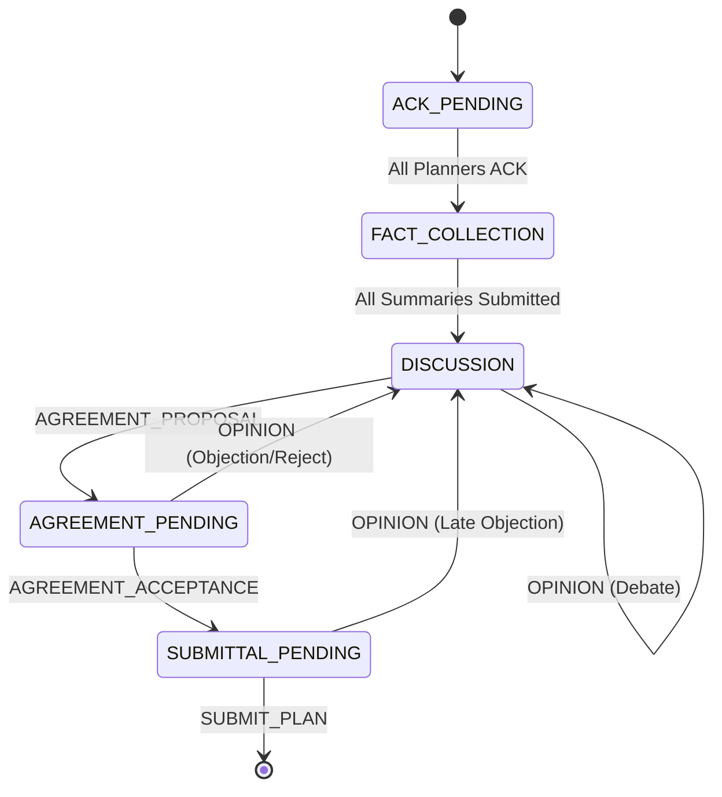

# Spec: Revised AgentTalk Planning/Consensus Protocol and Runtime Control-Plane

This spec defines a robust, deterministic control-plane and consensus protocol design for **AgentTalk**. It addresses the coordination failures observed in historical planning runs, moving protocol authority away from probabilistic LLM behavior and into the runtime control plane.

---

## 1. Title and Objective

* **Title**: Deterministic Runtime Control-Plane and Structured Consensus Protocol for AgentTalk
* **Objective**: Eliminate logic deadlocks, out-of-order execution, model loop cascades, and fragile text validation in multi-agent collaborative planning. This is achieved by introducing a single authoritative coordinator state machine, strict turn locking, proposal versioning/hashing, dynamic JSON schemas per turn, and clear demarcation between infrastructure and protocol faults.

---

## 2. Non-Goals

* **No Code Execution/Generation in Planners**: This spec is strictly about *planning/consensus* (generating the refactoring plan), not executing the plan.
* **No Rewrite of Agent Communication Substrates**: We do not replace the underlying JSON-RPC/WebSocket protocol, only the structured payload rules and state engine.
* **No Changes to Worker Execution Logic**: The worker execution role remains unchanged; only the planner-to-planner consensus loop is refactored.

---

## 3. Problem Statement & Failure Modes Addressed

Historical planning runs (all 49/50 marked `status=interrupted` in the repository) exhibit the following systemic failure modes:

| Failure Mode | Description | Root Cause |
| :--- | :--- | :--- |
| **Contradictory Local Prompts** | Agent-side client (`llm-agent.mjs`) injects instructions (e.g., forcing a `submit_plan` when replies run out) that conflict with the global coordinator state (expecting `agreement_acceptance`). | Lack of a single source of truth for allowed actions; local client prompt overrides. |
| **Fragile Copy-Paste Validation** | Orchestrator requires agents to copy the exact text of a proposal. If they modify a character or format, the step fails validation. | Use of raw string matching for proposal identification. |
| **Out-of-Order / Double Messaging** | Agent client splits a single LLM response into two protocol calls (e.g. `send_to_agent` and `agreement_proposal`) sent back-to-back, causing race conditions in the orchestrator. | Non-transactional response dispatching. |
| **Concurrent Cross-Talk** | Both planners concurrently propose different plans or attempt to endorse non-existent proposals because there are no turn constraints. | Lack of strict turn sequencing and write locks. |
| **State Map Desynchronization** | The `TeamCoordinator` tracks task states across multiple parallel, detached maps (`taskExpectedResponses`, `agreementStates`, etc.), leading to state drift. | Fragmented, non-cohesive session state. |
| **API Quota Cascades** | Format validation errors trigger immediate retries, creating infinite loops that exhaust Gemini/provider limits (429s). | Lack of retry/repair budget and backoff controls. |
| **Infra vs. Protocol Failure Confusion** | Transient provider failures (e.g. Gemini 429) put agents into `error` status, which immediately terminates active team tasks without retry or model failover. | Absence of a separate infra/protocol failure taxonomy. |

---

## 4. Core Design Principles

1. **Protocol Authority Lies in the Control-Plane**: The orchestrator determines what actions are legal at any point. Probabilistic LLM agents are strictly executors of permitted choices.
2. **Transaction-based Agent Turns**: An agent turn is a single, atomic exchange. One input event yields exactly one structured protocol response envelope.
3. **Reference by ID, Not Text**: Proposals are first-class versioned resources tracked by sequential IDs (`prop-1`, `prop-2`). Agents reference IDs; the runtime resolves the text.
4. **Dynamic Context-Aware Schemas**: The orchestrator generates a custom JSON schema and instructions for each turn, restricting the agent to only valid choices in the current state.
5. **Clear Separation of Failures**: Distinguish between transient infrastructure faults (retried with backoff/failover) and protocol regressions (subject to mediation or planned fallback).

---

## 5. Proposed Protocol Model

### Authoritative Coordinator State
All parallel maps in [TeamCoordinator](file:///Users/fausto/Software/AgentTalk/packages/runtime-core/src/registry/team-coordinator.ts) are replaced by a unified, transactional state object per planning task:

```typescript
interface Proposal {
  id: string;          // e.g., 'prop-1'
  proposerId: string;  // Agent ID
  text: string;        // The plan details
  timestamp: string;
}

interface PlanningSessionState {
  taskId: string;
  teamId: string;
  phase: PlanningPhase;
  versionToken: number;            // Monotonically increasing transition counter
  turnOwnerId: string;            // Agent ID holding the write lock
  allowedActions: StructuredMessageType[];
  proposals: Proposal[];
  pendingProposalId?: string;      // Proposed, awaiting endorsement
  acceptedProposalId?: string;     // Endorsed, awaiting submittal
  consecutiveDiscussions: number;
  regressionCount: Map<string, number>;
  fallbackCount: number;
}
```

### Phases and State Transitions


### Allowed Actions and Turn Sequencing
To enforce strict sequencing, the control-plane operates a **Turn Lock**. Only the `turnOwnerId` can submit a protocol message.

* **ACK_PENDING**:
  * *Allowed Actions*: `ack_planning_protocol`
  * *Turn Owner*: Concurrently expected from all planners.
* **FACT_COLLECTION**:
  * *Allowed Actions*: `fact_collection_end`
  * *Turn Owner*: Concurrently expected from all planners.
* **DISCUSSION**:
  * *Allowed Actions*: `opinion`, `agreement_proposal`
  * *Turn Owner*: Alternates between planners. Strict sequencing: Planner A -> Planner B -> Planner A.
* **AGREEMENT_PENDING**:
  * *Allowed Actions*: `opinion` (acts as rejection), `agreement_acceptance` (acts as endorsement)
  * *Turn Owner*: The peer who did NOT create the pending proposal.
* **SUBMITTAL_PENDING**:
  * *Allowed Actions*: `opinion` (regresses to discussion), `submit_plan`
  * *Turn Owner*: Deterministically assigned to the proposer (the author of the accepted proposal).

### Phase Fencing (Version Tokens)
Every protocol transition increments the `versionToken`. When the orchestrator prompts an agent, it bundles the current `versionToken`. 
* When the agent responds, it must echo the `versionToken`.
* If a response arrives with a stale token, the control-plane discards it as a stale event, preventing race conditions from late-arriving LLM generation results.

---

## 6. Agent I/O Contract

### Structured Response Shape
Every agent reply must match a rigid JSON envelope containing the routing token and the structured payload:

```json
{
  "version_token": 14,
  "message_type": "agreement_proposal",
  "message_payload": {
    "text": "Let us extract CopyButton from web/src/App.tsx.",
    "proposal_id": null,
    "plan": null
  }
}
```

### Dynamically Constrained Schema
Rather than sending static instructions, the orchestrator constructs the JSON schema dynamically *per turn*.

* **If the system is in AGREEMENT_PENDING**:
  * The schema's `message_type` enum is restricted to `["agreement_acceptance", "opinion"]`.
  * The `proposal_id` property is required and restricted to the pending proposal ID (e.g., `"prop-1"`).
* **If the system is in SUBMITTAL_PENDING**:
  * The schema's `message_type` enum is restricted to `["submit_plan", "opinion"]`.
  * The `plan` property is required and must follow the implementation-ready format.

### Mapping Freeform Reasoning to Events
To allow LLM chain-of-thought without corrupting the JSON structure, the schema includes a `reasoning` field:

```json
{
  "version_token": 15,
  "message_type": "agreement_acceptance",
  "message_payload": {
    "reasoning": "Planner A's suggestion covers the largest bottleneck. Agreeing advances us.",
    "proposal_id": "prop-1",
    "text": "I endorse the extraction of CopyButton."
  }
}
```

### Forbidden Patterns
* **No Agent-Side Message Splitting**: The agent client (`llm-agent.mjs`) must never emit both a chat message and a protocol message for a single turn. It emits one JSON response. The orchestrator is responsible for broadcasting the `text` to peers.
* **No Regex Interception**: Delete `extractCallMarkers` and `extractSystemRequiredCall` from [runtime.ts](file:///Users/fausto/Software/AgentTalk/packages/runtime-core/src/conversations/runtime.ts).
* **No Contradictory Local Prompts**: Prompt building in `runtime.ts` is driven entirely by the orchestrator's state. The agent client has no local overrides (such as forcing `submit_plan` on reply exhaustion). If replies run out, the orchestrator issues a graceful timeout/failure transition.

---

## 7. Runtime/Control-Plane Responsibilities

### Prompt Building & Schema Injection
The orchestrator serves as a gatekeeper. For each agent turn:
1. It looks up the `PlanningSessionState`.
2. It generates the system prompt injection specifying the current phase, turn index, and historical proposals.
3. It appends the dynamically restricted JSON schema.

### Validation Layers
The orchestrator runs validation in two sequential layers:
1. **Format Validation**: Ensures the response is valid JSON and conforms to the turn-specific schema. If it fails, the orchestrator requests a format retry (up to 2 times) with schema error details.
2. **Semantic Validation**:
   * Verifies `version_token` matches the current session state.
   * Verifies the sender is the current `turnOwnerId`.
   * Verifies `proposal_id` matches the active proposal in `AGREEMENT_PENDING` / `SUBMITTAL_PENDING`.
   * Verifies that `submit_plan` contains a plan that satisfies `assertPlanIsImplementationReady`.

### Stale Event Handling
If a message arrives with a stale `version_token` or from an agent that does not own the turn, it is logged and discarded. No state changes are triggered, and no replies are sent.

### Repair Loops
If an agent fails validation (format or semantic, e.g. invalid plan format), the orchestrator triggers a structured repair prompt:
* It includes the exact validator error message.
* It decrements the task's remaining repair budget (maximum 2 retries per session).
* If the repair budget is exhausted, it transitions the session to an orderly shutdown rather than looping infinitely.

### Failure Taxonomy
Failures are clearly categorized:
* `PROTOCOL_REGRESSION`: Agent confirmed a regression (e.g. going back to discussion).
* `VALIDATION_EXHAUSTED`: Agent repeatedly failed to produce valid JSON or concrete plans.
* `TIMEOUT`: Agent failed to reply within the watchdog window.
* `INFRASTRUCTURE_FAULT`: Provider rate limits, connection loss, or subprocess crashes.

---

## 8. Consensus Algorithm Details

### Proposal Creation
During `DISCUSSION`, any planner can submit a proposal. The orchestrator registers it in the session state:
* Generates `id` (e.g. `prop-1`).
* Appends to `proposals` array.
* Sets `pendingProposalId = 'prop-1'`.
* Transitions phase to `AGREEMENT_PENDING`.
* Shifts `turnOwnerId` to the other planner.

### Conflict/Merge Handling
Because turns are strictly sequential, concurrent proposals are impossible. If Planner A proposes a plan, the state transitions immediately to `AGREEMENT_PENDING` with Planner B owning the next turn. Planner B must either accept it (`agreement_acceptance`) or raise an objection (`opinion`), returning the state to `DISCUSSION`.

### Fallback Behavior
If Planner B objects (`opinion`) during `AGREEMENT_PENDING`:
* `pendingProposalId` is cleared.
* Session falls back to `DISCUSSION`.
* `fallbackCount` is incremented.
* If `fallbackCount > 2` (default limit), the orchestrator injects a mediation prompt listing both proposals and instructing the agents to consolidate them in the next turn.

### Loop/Progress Detection
If `consecutiveDiscussions` (turns spent in `DISCUSSION` phase without a proposal) exceeds `3`:
* The orchestrator injects a pressure warning instructing the current turn owner that they must either propose agreement or provide a novel concern.
* If it reaches `5`, the orchestrator terminates the session with `LOOP_DETECTED`.

---

## 9. Provider/Substrate Handling

### Readiness Checks
Before transitioning a team to `planning`, the orchestrator sends a lightweight ping (`healthcheck` payload) to all member agents. The session only starts if all agents reply with `healthcheck_ack` within 5 seconds.

### Quota/Backoff/Failover
To prevent quota cascades (e.g., Gemini 429 errors):
* **Exponential Backoff**: The agent runner implements jittered exponential backoff for all LLM calls (starting at 2s, doubling up to 30s).
* **Model Failover**: If an agent process encounters persistent 429s (exceeding 3 retries), the orchestrator can perform a hot-swap to a fallback model or secondary API key (e.g., falling back from `gemini-3.1-pro` to `gemini-3-flash` or `claude-3-5-sonnet`) without resetting the planning protocol state.

### Fault Demarcation
* **Infrastructure Faults** (`INFRASTRUCTURE_FAULT`) do *not* count toward the protocol retry budget. The orchestrator pauses the session timer during model failover/backoff.
* **Protocol Faults** (JSON syntax errors, invalid phase commands) use the repair budget.

---

## 10. Persistence and Observability

### planning_runs Schema
The files under [planning_runs/](file:///Users/fausto/Software/AgentTalk/planning_runs) must persist the full state history for debugging:

```json
{
  "taskId": "task-1775726540815",
  "status": "interrupted",
  "failureReason": {
    "code": "PROTOCOL_REGRESSION",
    "message": "Received submit_plan in AGREEMENT_PENDING",
    "rootCause": "Contradictory local prompt in agent reply count limit"
  },
  "protocolStateHistory": [
    {
      "phase": "DISCUSSION",
      "versionToken": 5,
      "turnOwnerId": "planner-a",
      "timestamp": "2026-04-09T09:28:09.584Z"
    }
  ],
  "proposals": [
    {
      "id": "prop-1",
      "proposer": "planner-b",
      "text": "Extract CopyButton from App.tsx"
    }
  ],
  "transcript": []
}
```

### Observability Metrics
* **First Failure Cause**: Logs the initial error (e.g. `LLM_JSON_PARSE_ERROR` at Turn 4) rather than the cascade symptom (`Agent entered error state` or `task interrupted`).
* **Replay/Debug Hooks**: Introduce an orchestrator CLI command (`npm run replay -- --run=<file>`) that reads a run log and replays the exact sequence of turns through the state machine validator to isolate engine bugs.

---

## 11. Test Plan

### Unit Tests
* `team-coordinator.test.ts`: Verify that out-of-order, stale version tokens, or invalid turn submissions are rejected.
* `response-schema.test.ts`: Test the dynamic schema generator with different constraints.

### Replay/Regression Tests
Write a script that parses the 49 historical interrupted run logs:
* Verify that the new coordinator successfully flags the contradictory local prompt as a design violation before execution.
* Mock the agent responses from a historical run and verify that using proposal IDs prevents the string mismatch errors.

### Adversarial/Stale-Event Tests
* Simulate Planner A sending a late reply after a phase fallback. Verify the stale token is discarded.
* Simulate both planners attempting to write simultaneously. Verify the lock rejects the non-turn-owner.

### Provider Failure Tests
* Inject mock 429 exceptions. Verify the backoff triggers and the orchestrator switches models without aborting the task.

---

## 12. Migration Plan

We can implement these changes incrementally in small, safe phases:

```
[Phase 1: Contracts] ──> [Phase 2: State Engine] ──> [Phase 3: Agent I/O] ──> [Phase 4: Cleanup]
```

### Key Modules to Modify
1. [protocol-payloads.ts](file:///Users/fausto/Software/AgentTalk/packages/contracts/src/protocol-payloads.ts): Add `version_token` and `proposal_id` to payloads.
2. [response-schema.ts](file:///Users/fausto/Software/AgentTalk/packages/runtime-core/src/agents/response-schema.ts): Implement dynamic schema constraint generator.
3. [team-coordinator.ts](file:///Users/fausto/Software/AgentTalk/packages/runtime-core/src/registry/team-coordinator.ts): Replace separate Maps with `PlanningSessionState` object and add turn locking.
4. [runtime.ts](file:///Users/fausto/Software/AgentTalk/packages/runtime-core/src/conversations/runtime.ts): Align prompt construction and remove local override conditions.
5. [llm-agent.mjs](file:///Users/fausto/Software/AgentTalk/scripts/llm-agent.mjs): Strip regex interception and map structured envelopes atomically.

### Compatibility Risks
* Older active agents that do not output the `version_token` envelope.
* *Mitigation*: The coordinator can support a fallback compatibility mode for legacy agents, translating their raw responses into the structured shape on the orchestrator gateway.

---

## 13. Open Questions and Tradeoffs

1. **Strict Alternating Turns vs. Freeform Discussion**:
   * *Tradeoff*: Alternating turns prevents race conditions but may slow down simple agreements.
   * *Resolution*: Keep turns strictly alternating for planning, but allow freeform replies in the brainstorm role.
2. **Dynamic JSON Schemas vs. Text Prompts**:
   * *Tradeoff*: Dynamic JSON schemas are highly reliable but require model support for structured outputs (like Gemini Structured Outputs or JSON Schema).
   * *Resolution*: Models that don't support JSON Schema natively will receive the schema formatted as part of the system prompt instructions.

---

## 14. Recommended First Implementation Slice

Implement **Phase 1 (Contracts)** and the **State Engine Refactoring**:
1. Define the unified `PlanningSessionState` interface.
2. Refactor the `TeamCoordinator` class to use this unified state object instead of parallel maps.
3. Write unit tests in `team-coordinator.test.ts` verifying that the state machine transitions correctly through the phases (`DISCUSSION` -> `AGREEMENT_PENDING` -> `SUBMITTAL_PENDING`) and blocks out-of-turn actions, using dummy agent IDs.
