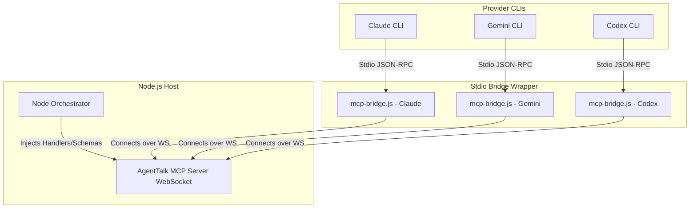

# Analysis: Standalone MCP Orchestration Package Extraction

This document summarizes the design discussion captured in [mcp-orchestration-proposal.md](file:///Users/fausto/Software/AgentTalk/design/mcp-orchestration-proposal.md) regarding extracting a standalone package to handle MCP (Model Context Protocol) communication with model CLI executors, replacing the legacy stdout-scraping line protocol.

---

## 1. Context & Motivation

AgentTalk currently drives provider CLIs (Claude, Gemini, Codex) as child processes, communicating via a line-prefixed stdout protocol: `[AgentTalk]:REQ/EVT/RES:{json}`. 

### Core Weaknesses of the Current Approach:
- **Brittle Transport:** Agent actions are parsed via prefix matching and line splitting. prose, ANSI noise, and partial line streams often break parsing.
- **No Schema Enforcement:** The model is requested to emit well-formed JSON via prompt instructions, with validation occurring only after receipt.
- **Divergent Paths:** Codex already uses JSON-RPC to communicate with a child process server (Node is the client), whereas Claude and Gemini scrape stdout lines.

---

## 2. Proposed Architecture: Node as MCP Server

Instead of Node acting as the client to provider servers, the proposed architecture **inverts the flow**:

### Key Technical Aspects:
1. **WebSocket Central Server:** Node hosts a central WebSocket server for turn routing.
2. **Stdio Bridge:** All CLIs execute a local bridge wrapper that maps standard stdio streams to WebSocket sockets.
3. **Actions as Tools:** Agent actions (messages, plans) are exposed as standard, typed MCP tools.

---

## 3. Packaging & Distribution Decision

The discussion establishes the following constraints for extracting this MCP orchestration layer:

| Decision Aspect | Chosen Approach | Rationale |
| :--- | :--- | :--- |
| **Location** | **Standalone Repository** (e.g., `@fausto/mcp-orchestration`) | Keeps it reusable outside of AgentTalk; forces a clean boundary. |
| **Dependency Mechanism** | **Pinned Git Dependency** in `package.json` | Avoids the overhead of NPM registry publication or local linking in production. |
| **Dependency Direction** | **One-way: AgentTalk $\to$ Library** | The library is completely provider- and protocol-agnostic. It knows nothing about AgentTalk. |
| **Tool/Handler Definition** | **Runtime Injection** | AgentTalk registers its own tool schemas and execution handlers (from `@agenttalk/contracts`) at startup. |

### The Prepare Hook Pitfall:
When a package is installed via Git, npm clones the repository but does **not** download the compiled artifacts (`dist`). Therefore, the standalone package must declare a `prepare` script in `package.json` (e.g., `"prepare": "tsc -b"`) to ensure TypeScript compilation executes on the client system upon installation.

---

## 4. Key Design Decisions & Refinements

Based on the simplified proposal, independent verification, and caveat resolutions, we have aligned on the following technical directions:

### A. Core Focus & Migration Rollout
*   **Simplified Scope:** The V1 implementation focuses strictly on turn execution routing. Orchestration/consensus tool calls resolve immediately to complete the turn. Query tool calls remain timeout-controlled, minimizing the risk of multi-minute timeouts.
*   **Flagged Incremental Cutover:** To adhere to project milestone rules, we will implement a flagged execution mode (e.g. `persistent_mcp`) and rollout provider-by-provider (starting with Codex), rather than executing a hard switch. Un-migrated providers will continue running the legacy stdout line protocol.

### B. Transport Architecture: Stdio-Bridge-for-All
We commit to a **stdio-bridge-for-all** topology to keep direct CLI network client implementations out of our critical path:
1.  **Unified WebSocket Server:** Node hosts a single central multi-tenant WebSocket server on a dedicated port.
2.  **Stdio Bridge Subprocess:** The orchestrator configures every spawned CLI to run `mcp-bridge.js` as its stdio subprocess:
    `"command": "node", "args": ["path/to/mcp-bridge.js", "ws://localhost:<port>/?agentId=<agent_uuid>"]`
3.  **Encapsulated Relay:** The bridge maps standard stdio JSON-RPC streams directly over the local WebSocket connection to the server. Session mapping is isolated via the `agentId` query parameter during the WS handshake.

### C. Turn-Loop & Concurrency Semantics
1.  **Turn-Loop Semantics:**
    - **Query Tools:** Standard resource queries execute via standard MCP tool call-and-response loops.
    - **Orchestration Tools (`send_to_agent`, `submit_plan`):** These act as terminal actions. The server immediately returns a success response to the tool call: `{ content: [{ type: "text", text: "Action sent successfully" }] }`. The orchestrator then completes the active agent turn execution and advances to the next step in the consensus workflow.
2.  **Multi-Agent Concurrency:** Tool handlers resolve asynchronously using Node `Promise` microtasks. Node's async event loop natively multiplexes overlapping tool calls across concurrent sessions.

### D. Session Isolation & Test-Contract Plan
1.  **Session Isolation:** WebSocket connections are mapped in-memory by `agentId` (UUID). In-flight JSON-RPC requests are scoped directly to the client's connection, preventing request/response ID collisions.
2.  **Test-Contract Plan:** State-machine/consensus tests will be refactored to mock the `Executor` interface, making domain logic transport-agnostic. Legacy stdout protocol parser tests will coexist and be retired only when stdout execution is deprecated.

---

## 5. Critical Operational Mitigations

1.  **Gemini Workspace Trust:** Spawns must configure `GEMINI_CLI_TRUST_WORKSPACE=true` or pass `--skip-trust`.
2.  **Non-Racy Configuration Cleanup:** Write temporary configurations to unique paths (e.g., `.mcp.<agentId>.json`) and clean them up on process **exit** hooks.
3.  **Bridge Failure Propagation:** If a bridge process exits or crashes, the executor immediately transitions the agent state to `error` to trigger the Milestone-03 failure-propagation protocol and prevent deadlock.

---

## 6. Pre-Switch Verification Plan (Gating Spike)

Before replacing legacy code, we will execute a targeted spike to verify the bridge and session routing mechanism:
- Build a mock WebSocket orchestrator server.
- Write the basic `mcp-bridge.js` mapping stdin/stdout to the WebSocket connection.
- Spawn Codex/Claude pointing to the bridge and verify that:
  1. The JSON-RPC handshake completes and tools are discovered.
  2. A 180s blocking tool call resolves correctly over the bridge.
  3. Two concurrent sessions connect and run overlapping calls without cross-talk or collision.
