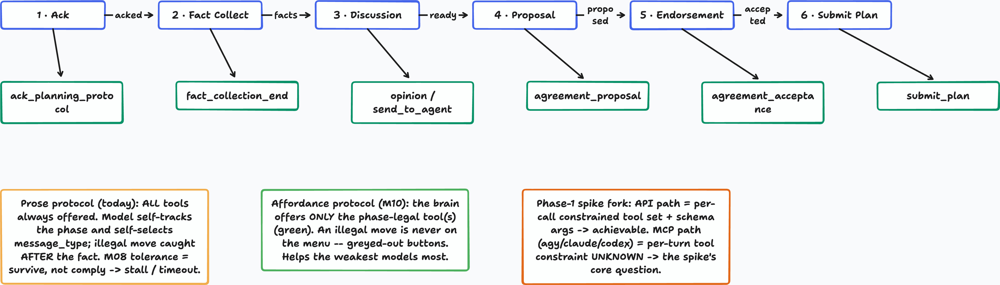

# Milestone 10 — Robust consensus via a graded, stateful protocol brain — Plan

> **Spike-led epic.** M10 makes multi-agent consensus robust. The mechanism — settled in a design
> exchange (Fausto ↔ Claude, 2026-06-25) — is **not** hard decode-time enforcement, but a **graded,
> bounded, closed-loop protocol brain** that works on *any* transport. Phase 1 is a design spike
> (read/research + small probes, **no production changes**); Phase 2 (implementation) is shaped by it.

## 1. Thesis — compliance via a closed feedback loop, not hard enforcement

The recurring failure across M06–M08 (LB-6/7/8) is agents not following the consensus phase machine
(ack → fact_collection → discussion → proposal → endorsement → submit_plan); weak models hallucinate
illegal transitions. M08 made the engine **tolerant** (don't dual-crash) — but LB-10's "tolerance ≠
compliance" still bit: *passive* tolerance stalls.

**The cure is an *active, bounded* loop, owned by the brain.** Each turn:

```
agent responds  →  brain validates against the CURRENT phase-legal set  →
    valid     → ack + advance state ("you're now in state XX")
    invalid   → reject + correct + retry ("not valid here; your options are {agree, back_off}")
    repeated  → eject the agent, peer-safe ("ejected — see you when you're sober")
```

This is **not** the naive M08 tolerance LB-10 criticized. It is **closed-loop** (a precise correction,
not the same prompt again) and **bounded** (the eject rung guarantees termination instead of an infinite
stall). Active + bounded is the difference between *survives* and *succeeds*.

## 2. The design (settled)

- **One tool, not twelve.** Collapse `submit_plan` / `agreement_proposal` / `agreement_acceptance` / …
  into a single **`consensus_respond(action, payload)`**. With one tool the model *cannot call the wrong
  tool* — a whole failure class (LB-7/8 "picked an illegal message_type") disappears for free.
- **The legal-move map is deterministic and server-side.** "agreement phase → {agree, back_off}" is a
  pure function of the phase; the brain already knows the phase, so the legal `action` set per turn is
  fully scriptable ahead of time.
- **Restate the *current* affordance each turn — don't re-send the whole protocol.** The attached agent
  is **memory-capable** (already the implemented reality: M06 rewrote the executor for native persistent
  multi-turn, `agy --continue`, to "reliably simulate MCP-based agent statefulness"). So the full
  protocol rides in the agent's transcript memory; only the **current-turn legal set** goes in each turn
  payload ("phase: agreement; valid: {agree, back_off}"). Cheap, and the single biggest lever for
  first-try compliance — it counters instruction-drift over long context without re-sending the schema.
- **Graded validation + bounded eject** is the brain's job, in *our* code (`team-coordinator.ts` +
  the driver), on a path we fully control — independent of transport.

Visual (snapshot committed in-repo so it survives without the DiagramTalk server; source spec alongside):



*Phase spine → the per-phase legal `action` set the brain restates each turn → one-tool / graded-brain /
enforcement-as-optimization framing. Source: [`diagrams/m10-affordance-protocol.layout.json`](diagrams/m10-affordance-protocol.layout.json).*

## 3. Hard enforcement = an *opportunistic optimization*, not a gate

Where we own the model's request directly (the **API path**), native function-calling gives hard
guarantees: `tool_choice` forces the call, `strict: true` guarantees the arg schema, an `enum` pins the
`action` to the legal set — so the **first** answer is always legal and the retry round-trip is skipped.
That's a token/latency win **on the API path only**. On the **MCP path** the provider's harness owns the
model's request and MCP ships a tool's schema as a *description*, not a decode-time constraint — so the
narrowed `enum` is a strong hint, not a guarantee. **That's fine:** the graded loop (§1) catches the
miss and re-prompts. Enforcement, where available, just means fewer retries — it is **not** load-bearing
for robustness. This demotes the old "API-vs-MCP substrate fork" from a blocking risk to a measurement.

## 4. Named risk — the eject rung must be peer-safe

The "see you when you're sober" rung is the one with real teeth. Ejecting a babbling planner is correct,
but ejection is exactly the fault-tolerance surface that bit us before: the **LB-7/8 bug was that one
planner's illegal move dual-killed the peer.** The eject path must drop the bad agent **without** taking
down the consensus or the surviving planner — i.e. clean failure propagation (the M03/M08 work). The
schema/affordance parts are easy; **graceful, peer-safe eject is where the engineering risk now lives.**

## 5. Phase-1 design spike — goal & boundaries

**Goal:** an evidence-backed design + go/no-go. **Read/research + small probes only; no production
changes.** Deliverables:
- **DQ1 — Injection map.** Where in the engine does protocol validation/correction happen today
  (`team-coordinator.ts`, the driver, response parsing)? Pin the exact sites where the single-tool +
  per-turn-affordance + graded-validate/correct/eject loop would slot in, **preserving all existing
  behaviour** until deliberately changed.
- **DQ2 — Peer-safe eject.** Trace the current failure-propagation path (`handleAgentFailure` and the
  M03/M08 fences). Confirm an agent can be ejected mid-consensus without dual-killing the peer, and name
  exactly what Phase 2 must add/change to make "eject one, keep the round alive" true.
- **DQ3 — Enforcement-optimization reach (measurement, not a gate).** API path: which providers' native
  function-calling supports per-call tool restriction + `strict` + `enum` (research current provider
  docs — **not from memory**; `claude-api` skill for Anthropic). MCP path: does a single
  `consensus_respond` tool whose `action` enum we narrow per `await_turn` get (a) re-read each turn and
  (b) *bound* the model to the enum, or merely *suggested*? Per harness (`agy`/`claude`/`codex`).

**OUT of scope (do NOT change in Phase 1):** the engine, the brain, the wire-contract, provider wiring.
No implementation. Also out of M10 entirely: **operator abort/recovery for `awaiting_operator` tasks**
(M08-T3 shipped fence-only; its own future milestone).

## 5b. Phase-1 RESULT — ✅ DONE (2026-06-25, full detail in logbook **LB-20**)

Read-only spike complete; no production code changed. Headlines:
- **DQ1 — the affordance data already exists.** The brain owns phase truth (`getPlanningPhase`,
  `team-coordinator.ts:862`), already *computes and sends* the legal set per turn (`expected_response_types`,
  `:462`), already validates `message_type` (`:441`), and already has a *bounded* correct-and-retry for the
  agreement step (`:788`). "Restate the affordance each turn" is **~half-built** (sent as advisory, not
  enforced). Single-tool collapse point = `translation.ts:11-82`.
- **DQ2 — peer-safe eject does NOT exist; the dual-kill is confirmed.** Every violation funnels into the single
  sink `interruptPlanningForMissingEvents` (`:1702`), which kills the task + team and **shuts down every
  planner** (`:1733-1742`). The only non-killing path (`pauseTaskForOperator`, `:1529`) is worker-exec-only.
  **Phase 2 must add a new `ejectPlanner` path** — the load-bearing 🔴 risk — and decide degrade-vs-fail-soft
  for the resulting 1-planner state.
- **DQ3 — both paths are prompt-and-parse *today*.** `api-client.ts` sends only `response_format:json_object`
  (no `tools`/`tool_choice`/`strict`/`enum`); the API-path optimization is **greenfield, not a retrofit**, and
  reachable per-provider (verify deepseek/gemini). MCP per-turn enum-binding is unmeasured (live per-harness
  probe deferred). **Verdict holds: enforcement = optimization, graded loop = floor.**

**Phase-2 task breakdown (proposed — see LB-20):** ① single `consensus_respond(action,payload)` ·
② generalise the bounded correct→retry loop (extend `parseWithRetry` from malformed → illegal-move) ·
③ 🔴 peer-safe `ejectPlanner` + degrade/fail-soft decision · ④ *(optional, separate)* API-path
`tools`+`tool_choice`+strict-`enum` optimization. Phase 2 gets its own plan, written next.

## 6. Definition of Done (Phase 1)  — ✅ met (see §5b / LB-20)

1. **Design doc** (logbook `LB-N` + this plan updated): the single-tool + restated-per-turn-affordance +
   graded-bounded-loop design, with the **injection map** (DQ1) and the **peer-safe-eject analysis**
   (DQ2) grounded in real code refs.
2. **Enforcement-optimization measurement** (DQ3): per-path/per-provider, what hard enforcement buys and
   where it's unavailable — framed as an optimization, with the graded loop as the floor everywhere.
3. **Phase-2 task breakdown** (or no-go): concrete steps to build the graded brain + single tool + eject
   safety, sequenced; the API-path enforcement optimization listed as a *separate, optional* follow-on.
4. **No production code changed** (Rule 5 clean); probes live in `scratchpad/`, not the repo.

## 7. Sequencing & notes

- Phase 1 = design/feasibility; Phase 2 (implementation) is a separate plan written **after** it. The
  bulk of the work now lives in **our** code (the graded brain + peer-safe eject), not in betting on MCP
  enforcement — a materially safer epic than the original affordance-hinges-on-MCP framing.
- Implementer = Claude under LB-14 (Gemini out of budget); serial-actor rule applies.
- Honesty over results: "MCP won't bind the enum" is a *measurement*, not a failure — the graded loop
  already covers it.

## 8. Open items

- **✅ Milestone numbering — ACCEPTED (Fausto, 2026-06-25): M10 = this epic.**
- **Diagram** (`design/diagrams/m10-…`) refreshed to the graded-brain thesis at scoping time.
