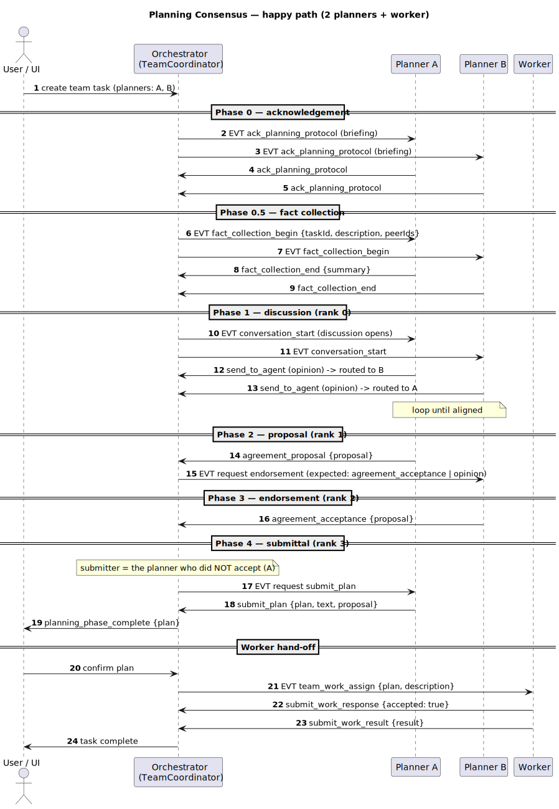
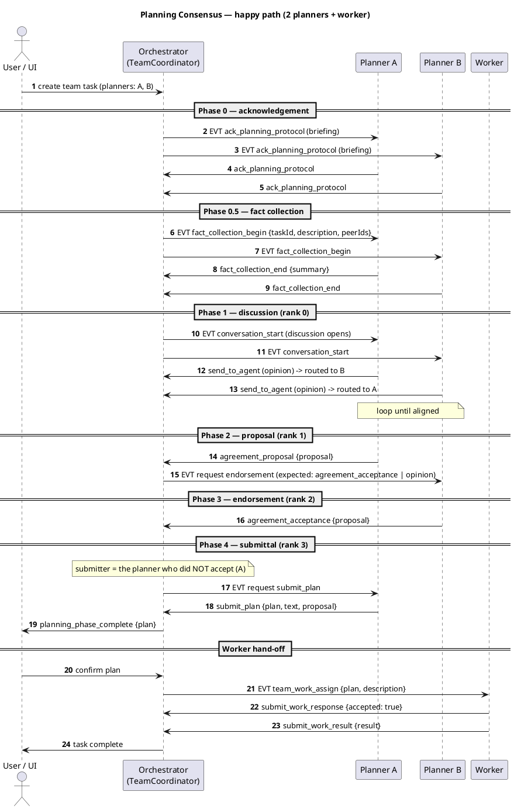
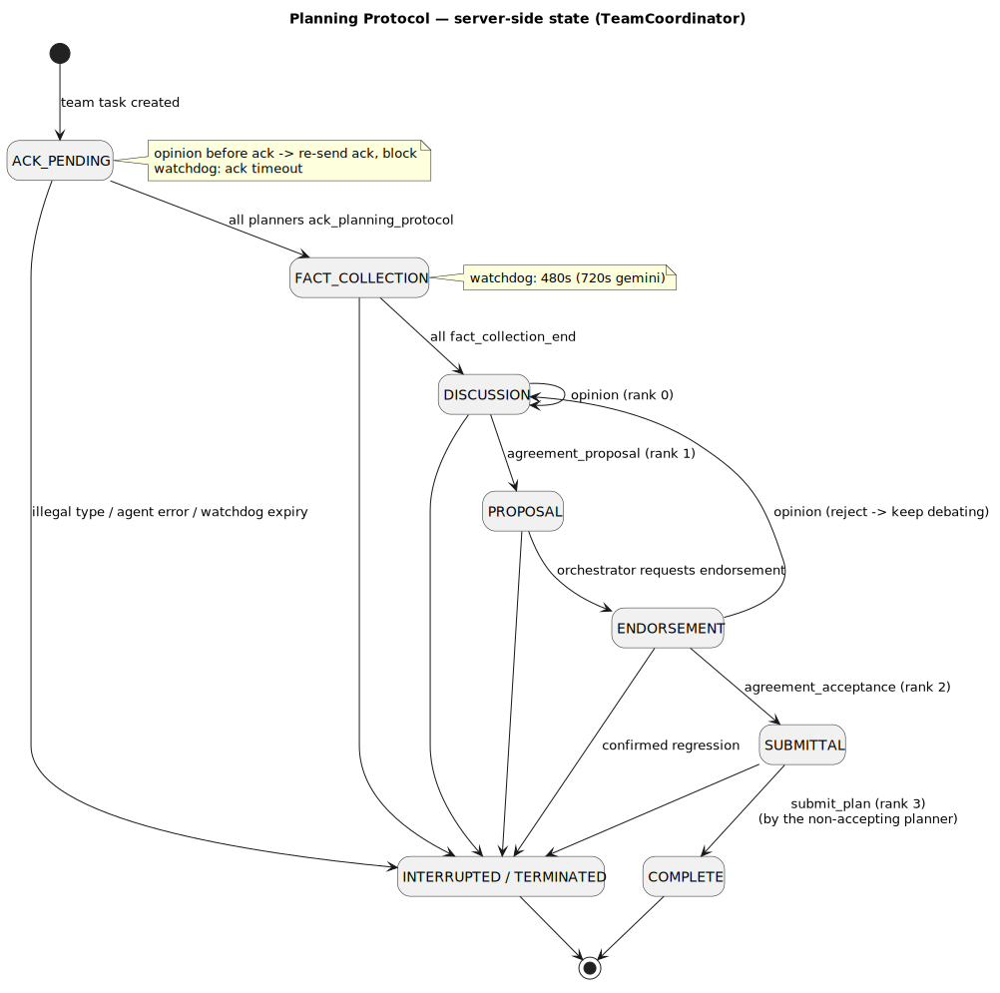
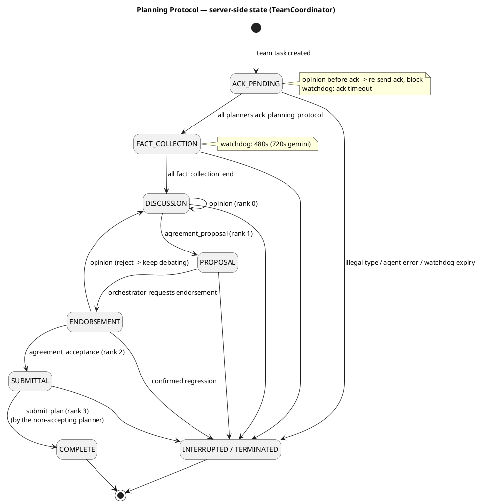
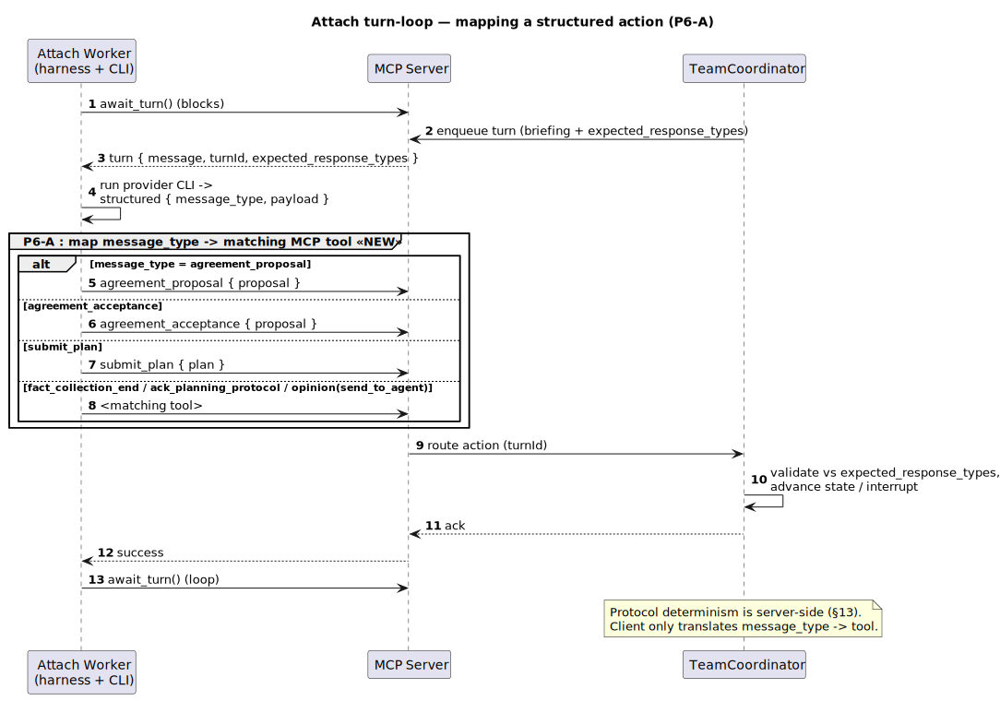
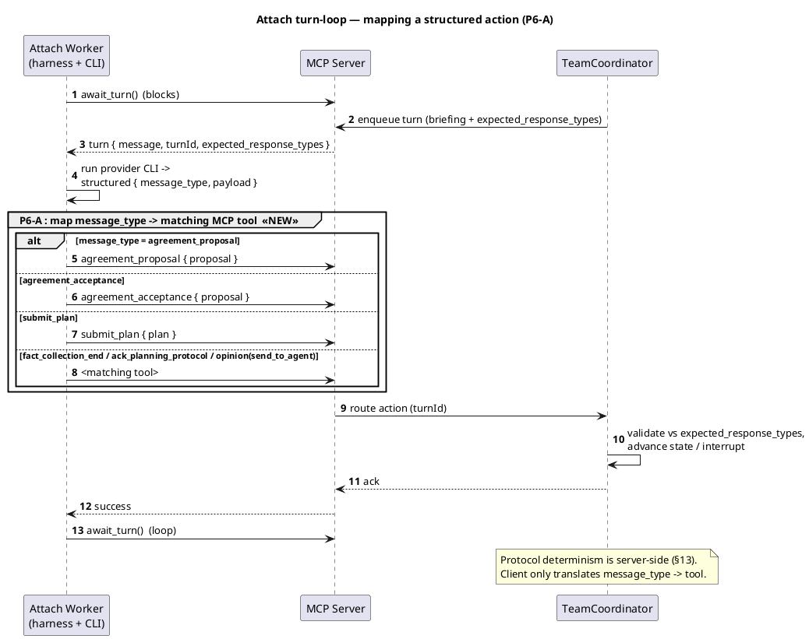

# Planning / Consensus Protocol — Visual Flow

**Status:** Reference (Claude, 2026-06-20). Grounded in `design/planning-protocol.md` +
`TeamCoordinator` + `mcp-tools.ts`. Diagrams are **PlantUML** in fenced ` ```plantuml ` blocks
— view in a Markdown reader with PlantUML support (e.g. VS Code "Markdown Preview Enhanced",
Obsidian + PlantUML plugin) or paste a block into any PlantUML renderer.

> Three views: **(1)** the end-to-end consensus sequence, **(2)** the protocol state machine
> (the rules), **(3)** how a single consensus step rides the attach turn-loop (the Phase-6
> integration point).

---

## 1. End-to-end consensus sequence (2 planners → plan → worker)

Two attached planners run the protocol; the orchestrator (`TeamCoordinator`) is the referee.
The proposer submits the plan; the peer only endorses (`planning-protocol.md` §submittal).





---

## 2. Protocol state machine (the rules)

The orchestrator advances **forward-only** by `message_type` **rank**; an out-of-step type is
interrupted, a regression triggers a confirm-or-terminate. Watchdog timers guard each wait.





**Rank rule:** `opinion`(0) → `agreement_proposal`(1) → `agreement_acceptance`(2) →
`submit_plan`(3). The orchestrator only accepts a type whose rank advances the current step;
the **client never decides validity** — it just emits the tool for the model's `message_type`
(§13). Enforcement, regression handling and watchdogs are all server-side.

---

## 3. One consensus step over the attach turn-loop (Phase-6 integration point)

This is the pull loop. **Today** the attach worker always emits `send_to_agent`; **Phase 6
(P6-A)** is the single highlighted step: emit the MCP tool that matches the model's
`message_type`. Everything else already exists.





---

## Rendering notes
- Each diagram is committed as a rendered **SVG** in `./diagrams/` (shown inline above) **and**
  kept as editable PlantUML source in the fenced block — so it displays in any Markdown viewer,
  while PlantUML-aware viewers can also render the source.
- `plantuml` is installed (Homebrew). To re-render after an edit:
  `plantuml -tsvg -o diagrams design/planning-protocol-diagrams.md` (extracts every
  `@startuml`/`@enduml` block, names each SVG after its diagram id).
- Kept deliberately close to `design/planning-protocol.md` (the prose source of truth); if the
  protocol changes, update the source block **and** re-render.
