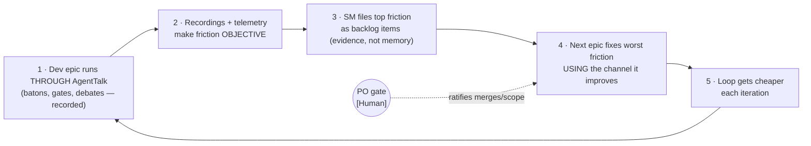
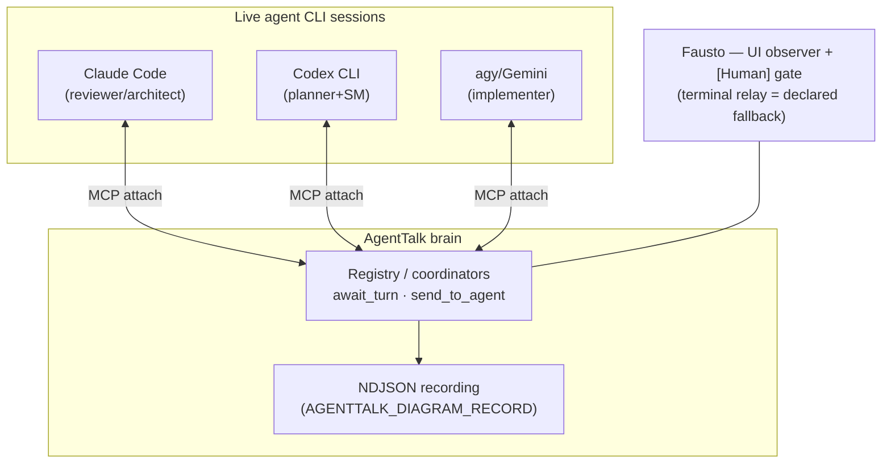

# Self-Hosting Program (M16 → M18) — AgentTalk improves itself

**Status:** 🟢 **ACTIVE — M16 OPENED at the 2026-07-08 backlog gate (BL-013 `doing`; SM: Claude, PO go in
session).** Role-skill injection ruled **M19 candidate** (BL-014); SP-WAKE layer (a2) skipped (M16's live
proof covers realistic idle). Planner authors the M16 plan next; gate 1 (plan review) follows.
**Roles:** per `AGENT.md → 📌 DEFAULT ROLE ASSIGNMENTS` (2026-07-08 model — three reviewer seats; SM handed
Codex → Claude). *(Inception-time roles line preserved below as the 2026-07-02 record.)*
**Inception record (2026-07-02) — PO:** Fausto · **Architect:** Claude (author) · **Planner + SM (then):**
Codex · **Implementer:** Gemini/agy ·
**Reviewer:** per-epic PO call (M15 note: independent review after any self-reviewed closure).
**Sacred goal (PO, 2026-07-02):** set AgentTalk up so it **incrementally improves itself**.

## The flywheel (what "improves itself" means here)

Self-improvement is a **loop we enter**, not a feature we ship. The human stays the governor: merges and
scope remain PO-gated (`[Human]`), exactly as the Mode-A ratifier frame worked in M15.

The loop closes for the first time at **M18** (first epic about AgentTalk coordinated *by* AgentTalk).
M16–M17 are bootstrap. Standing insurance for the whole program: **the terminal relay stays a declared,
working fallback** — freeze-don't-remove, per the protocol-machine precedent. If a step goes sideways, we
fall back for that step only, file what broke as spike gold, and take a smaller bite.

## Target topology

## Milestone ladder

### M16 — One real baton *(embarrassingly small, by design)*

**Goal.** Two live agent sessions attach (planner-seat and reviewer-seat); **one origin-tagged, role→role
baton** travels through the brain, is recorded, and the PO watches it land in the UI instead of pasting it.
**Scope sketch (fence at epic plan time).** Attach-mode plumbing reuse (M05); a minimal baton message shape
carrying the Origin Tag Protocol tag as data; recording on; a live proof run. **No** new consensus logic,
**no** `team-coordinator.ts` diff (frozen path + suite + M14 identity harness remain the freeze bar), **no**
UI beyond what exists.
**DoD claim sketch.** C1: one real baton delivered agent→agent through the brain, recorded (NDJSON evidence
with the tag visible). C2: freeze bar green. C3: fallback documented — the same baton relayed by terminal
still works.
**Known unknown (the reason M16 exists):** the **idle-agent wake problem** — see SP-WAKE below. M16's shape
(blocking `await_turn` vs. pull-on-poke) is decided by the spike's evidence, not by optimism.

### M17 — The gate over the channel

**Goal.** Reviewer verdicts and SM go/no-go flow through AgentTalk; **origin tags become structured metadata
the brain enforces** (a `[Codex]` operational instruction vs. `[Human]` PO act is machine-checkable, not
square-bracket convention). PO relay burden shrinks to poking idle agents (or nothing, if SP-WAKE says
blocking waits hold).
**Framing (Codex POV caution 3, adopted):** tag enforcement is **workflow-authority correctness, NOT
adversarial security.** Its real substance is the mapping **attached session → agent identity → role
assignment**, with `[Human]` kept a distinct trusted channel. M17's plan must spec that mapping first; the
refusal test is a consequence of it, not the feature.
**Scope sketch.** Session→identity→role mapping; message metadata schema + enforcement at routing; gate
events surfaced in UI/recording; workflow docs updated to name the channel as primary and terminal as
fallback.
**DoD claim sketch.** C1: a real reviewer verdict and a real SM go delivered and recorded over the channel.
C2: a PO-level act attempted with a non-`[Human]` tag is refused by the brain (negative test). C3: freeze
bar green.

**INCEPTION (PO + Architect, 2026-07-09) — fence set, two dispositions recorded (PO adopted the architect's
recommendations; written down here for future resurfacing at the PO's request):**
1. **Fence = the mapping and its enforcement, nothing more.** Session→identity→role mapping; message
   metadata schema + enforcement at routing; gate events surfaced in UI/recording; the C1–C3 claims above.
   Any scope growth is an automatic Gate-1 hand-back (same standing guard M16 ran under).
2. **The exec-bridge baton gap (M16 gate-3 deviation D1 — real CLI sessions can't carry `baton` args) is
   NOT pulled into M17 by default.** The planner's advisory POV must assess feasibility: can M17's live
   proof (C1) run without it — direct SDK MCP clients remaining acceptable proof vehicles, as in M16? If
   the proof structurally requires the fix, escalate back to the PO for a fence decision *before* plan
   authoring; otherwise the gap defers to M18-or-later (**tracked: BL-017**).
3. **Cross-repo contract-hash evolution stays a manual, PO-gated act.** M17 *rules* on the question, it
   does not *build*: at most a clearer version label on the wire contract. Versioned negotiation is
   deliberately deferred (**tracked: BL-018**; reopen if a contract bump recurs and bites again) — building
   auto-negotiation now would be process for a problem observed exactly once (program risk #3).

**Planner advisory POV (Codex, PO-relayed, 2026-07-09) — RECORDED.** On the inception's load-bearing
question: the C1 live proof **can run with direct SDK MCP clients** as the proof vehicle — the exec-bridge
fix (BL-017) need not enter the fence; recommendation to open M17 for plan authoring without it. *(The relay
was compressed to the recommendation line; full reasoning stayed in the planner's session — recorded as
such, honestly.)* **M17 OPENED at the 2026-07-09 backlog gate — BL-019 `doing`; next act: the planner
authors the plan, then Gate 1.**

**M17 DELIVERED AND CLOSED same day (2026-07-09).** C1–C3 (plan C1–C7) all VERIFIED; merges `5e4ca27` /
`59856f9` / `467bd4a`; ledger `design/milestone17-gate-over-channel-implementation.md` frozen. The negative
test is live-proven: an attached session claiming `[PO]`/po-act is refused pre-delivery by the brain.
**Relay count ≈15 — flat vs M16, honestly stated:** M17 built the gate over the channel but the *humans'*
gates still relay via terminal until real CLI sessions can emit envelopes — the relay-count fall is
BL-017/M18's claim. Pre-named M18 inception inputs: **BL-017** (exec-bridge baton gap — likely M18-T1),
**BL-020** (orchestrator dies on attached-client disconnect — the substrate cannot host a real epic while it
can be killed by a disconnect), plus the planner meta-concerns #3/#4 (2026-07-09).

### M18 — Self-hosting milestone *(the flywheel's first turn)*

**Goal.** One full, deliberately small dev epic runs end-to-end on the substrate — planning baton, gates,
implementation hand-offs, closure — with the terminal used only if a declared fallback moment occurs.
**Scope sketch.** No new machinery by default; this epic *consumes* M16+M17. Candidate rider: repair the
DiagramTalk endpoint (unavailable since M15-T3) so recordings render as live diagrams — observability
dessert, PO's "spectacular diagrams" done properly. Post-epic: SM files friction→backlog from the
recordings — **that act closes the loop and is the program's true DoD.**
**DoD claim sketch.** C1: the epic's every baton/gate exists in the recording. C2: friction→backlog entries
cite recording evidence. C3: PO relay count during the epic ≈ 0 (poke-only or none); fallback moments, if
any, honestly logged.

## SP-WAKE — preparatory spike (architect's side-dish pick; runs on PO go, pre-Jul-8 window)

**Question.** Can a long-lived interactive CLI session (Claude Code / Codex CLI) attach to AgentTalk over
MCP, block on `await_turn` for a realistic idle period, and wake cleanly when a baton arrives — repeatedly?
M05 proved attach-and-complete-a-turn with a harness; it did **not** prove long-lived interactive blocking.
**Method.** One attached real session + one harness-driven sender; three probes: (a) immediate turn, (b)
turn after ≥10 min idle, (c) two consecutive turns without re-attach. Recording on. Client-side timeout
behavior noted per CLI.
**Pre-registered budgets:** attach + probe (a): max 2 attempts · probe (b): max 2 · probe (c): max 2 ·
freeze-bar re-run after any code touch: 1. Hygiene sweep (`git worktree list`, `ps`) every round.
**Honest bar.** Outcome is a **finding, not a pass/fail**: "blocking holds" → M16 uses `await_turn`;
"blocking breaks at N minutes / on timeout X" → M16 ships pull-on-poke and the finding seeds an M17+ wake
fix. Either answer is spike gold. **Scope fence:** no runtime changes without a fresh PO go; observation
first.
**Resources.** Cents-scale LLM cost (none expected — plumbing only), one session slot on Claude or agy;
Codex not required.

### SP-WAKE layer (a) — RESULT: PASS ✅ (Claude, 2026-07-02 night, PO go in session)

**Run:** real `agentalk-mcp-client` (`llm-agent.mjs`, persistent mode) attached to a real `McpExecServer`
(60s WS keepalive), provider replaced by the fake persistent bridge (zero LLM spend) — the layer-(a)
apparatus derived from `scripts/smoke-mcp-exec-server.mjs`. Dry run (5s idle) validated the apparatus, then
the full run:
- **Probe A (immediate turn): PASS** — round-trip 190ms.
- **Probe B (wake after 600s true idle): PASS** — round-trip **3ms**; client held `await_turn` through the
  whole window (keepalive pings only), no disconnect, no death.
- **Probe C (consecutive turn, same attachment): PASS** — 54ms.
- Exit 0; teardown clean (no stray processes, no temp dirs, repo untouched).

**Finding:** the **client-side long-lived blocking model holds** — `await_turn` survives ≥10 min of silence
and wakes instantly. **M16 may be designed around blocking `await_turn`;** pull-on-poke demotes from
"probable shape" to "declared fallback." **Caveats, honestly:** (1) server side was `McpExecServer`
in-process, not the full orchestrator attach server — same wire protocol, but M16's live proof must run
against the orchestrator; (2) 10 minutes ≠ hours — an overnight-scale idle remains unproven (cheap optional
layer-(a2) probe if the Jul-8 gate wants it); (3) layer (b) — a *native* interactive CLI session (e.g.
Claude Code itself) attaching without the client shim — is untested and remains M16's stretch question, not
its foundation.

## Sequencing & resources (inception record)

- **Build waits for full strength: ~Jul 8** (Codex weekly resets Jul 7 ~07:14; at inception Codex 84% weekly,
  Claude ~30%, agy fresh daily). Pre-Jul-8 window = side dishes only: this draft, Codex's advisory POV
  (cheap), SP-WAKE on PO go.
- **Serial actors rule stands** (PO, 2026-06-22): no parallel agent development until per-actor token
  attribution exists — parallel digging would blind the telemetry the flywheel depends on. Re-examined, not
  removed, inside this program (per-actor attribution is itself a likely early friction→backlog item).
- **Backlog:** M16 (and the program pointer) to be gated into `backlog.md` at the ~Jul-8 backlog gate by the
  SM with the PO — not pre-created here; this draft is the inception artifact the gate consumes.
  **DONE (2026-07-08): BL-013 `doing` (M16) + BL-014 `todo` (M19 candidate); gate record in `backlog.md`.**
- **Per-epic plans** (fences, full DoD tables, per-check budgets) get authored at each epic's own inception;
  the sketches above are altitude, not spec.

## Candidate: role-skill injection (PO idea, 2026-07-02 midnight — draft altitude ONLY)

**Idea (Fausto):** condense the scrum workflow (roles, gates, batons, origin tags, Rules of Engagement,
primer handshake) into a **skill agents follow — injected**, so attached agents abide by their seat by
construction, not by convention.
**Architect read:** the degraded version already runs — `AGENT.md` auto-slurp, role primers, lessons files
are file-based, local, driftable injection. The real move is **brain-served role briefs at attach time**,
riding M17's session→identity→role mapping: on attach, the substrate serves "you are `<role>`; here is your
law" — versioned from the repo, identical for every provider, recorded like any message. Converts workflow
from per-CLI context files into something the channel administers; also collapses primer-handshake drift
(the brain knows what's fresh).
**Discipline:** rider-sized idea with epic-sized gravity — it does **NOT** enter M17's fence (Codex caution
2 applies). Jul-8 gate decides: M18 rider, M19 candidate, or parked. No code before that.
**DECIDED (2026-07-08 gate): M19 candidate — filed as BL-014 (`todo`); re-gate after M17 evidence.**

## The program metric — relay count (Codex POV caution 5, adopted)

**Definition (counting rule, fixed now so the metric can't be gamed later):** one relay = one manual PO act
of **pasting a baton/report between sessions, typing a relayed instruction on another actor's behalf, or
poking an idle agent to make it check anything**. Reading the UI is free; `[Human]` decisions are free (they
are PO acts, not relays); pokes count (they are relay residue — M16's pull-on-poke fallback keeps them
countable on purpose).
**Baseline (M15, honest approximation):** the entire M15 epic ran PO-relayed — every planner/reviewer/
implementer baton, gate hand-back, and fix round crossed Fausto's terminal; order of magnitude **~20–30
relays in one day** (exact count unrecoverable; the point of this program is that from M16 on the recording
counts it for us). **Each epic's closure telemetry records its relay count; the program succeeds iff the
number falls epic over epic.**

## Planner advisory POV (Codex, PO-relayed, 2026-07-02 night) — RECORDED

Direction endorsed: *"M16→M18 attacks the actual bottleneck we just experienced… use AgentTalk for one tiny
coordination act, record the friction, then fix the worst friction with evidence."* Five cautions, with the
architect's dispositions:
1. **SP-WAKE before M16; if wake breaks, design around pull-on-poke, not hope.** — Agreed; already the
   draft's rule (M16 "shape decided by the spike's evidence"). Spike running at POV time.
2. **M16 stays embarrassingly small** (no gates, no enforcement, no UI ambitions). — Agreed; already the
   fence. Standing guard: any M16 scope growth is an automatic hand-back at Gate 1.
3. **M17 tags are workflow authority, not security; the real work is session→identity→role mapping,
   `[Human]` a distinct trusted channel.** — **Adopted; M17 section amended** (mapping first, refusal test
   as consequence).
4. **DiagramTalk rides M18 only if genuinely cheap — dessert, not the meal.** — Agreed; rider stays
   explicitly droppable, M18's DoD unchanged without it.
5. **Define relay-count now; M15 is the painful baseline.** — **Adopted; metric section added above**
   (counting rule + M15 baseline + per-epic telemetry).
Sequencing rec (SP-WAKE observation-only → Jul-8 gate opens M16 shaped by spike result → M17/M18 stay
draft-altitude until M16 evidence) — matches the draft; adopted as written.

## Risks (stated at this altitude)

1. **Wake fragility** (the M16 unknown) — mitigated by SP-WAKE deciding M16's shape before the epic opens.
2. **Coordination-on-coordination:** a substrate bug mid-epic takes the team's channel down — mitigated by
   the standing terminal fallback and M18's "deliberately small epic" rule.
3. **Meta-work creep** (Claude's recorded recurring blind spot): the program must not grow ceremony faster
   than it removes relay burden. Proportionality check at every gate: *did the PO's per-epic relay count go
   down?* If not, the program is failing regardless of green suites.
